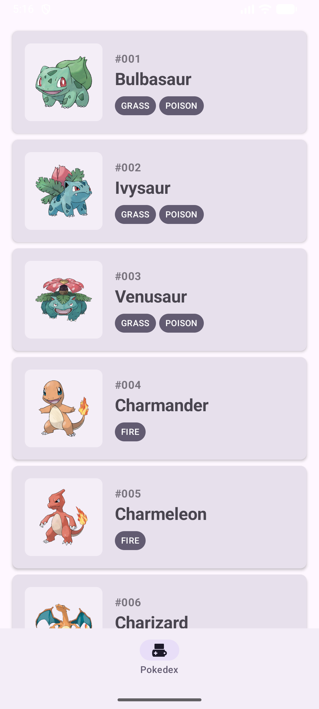

# PokéBase ⚡
**A modern, high-performance Pokédex for Android**

PokéBase is a digital Pokédex that provides a rich, interactive experience for browsing Pokémon. Built with **Clean Architecture** and the latest **Android Jetpack** components, it demonstrates modern Android development practices, including reactive UI, robust networking, and smooth animations.

---

## 📸 Preview

<div align="center">
  
  <br>
  <i>Home Screen Overview</i>
</div>

### 🎬 Experience the App
Check out the app in action, featuring smooth Lottie animations and Jetpack Compose transitions:

[**Watch the Screen Recording**](screenshots/home_recording.mp4)

---

## ✨ Features
- **Real-time Data:** Fetches the latest Pokémon information from the [PokeAPI](https://pokeapi.co/).
- **Modern UI:** Built using **Jetpack Compose** for a declarative and responsive interface.
- **Fluid Animations:** Integrated **Lottie** animations for an engaging "Pokéball" loading experience.
- **Clean Architecture:** Separated into Data, Domain, and Presentation layers for maximum maintainability and testability.
- **Image Caching:** Leverages **Coil 3** for efficient image loading and memory management.

---

## 🛠 Tech Stack & Tools
- **Language:** Kotlin (with Built-in Kotlin support in AGP 9)
- **UI:** Jetpack Compose & Material 3
- **Architecture:** MVVM + Clean Architecture
- **Dependency Injection:** Hilt (using KSP for faster compilation)
- **Networking:** Retrofit 3 & OkHttp 4
- **Concurrency:** Kotlin Coroutines & Flow
- **Animations:** Lottie for Android
- **Build System:** Gradle 9.5 + Android Gradle Plugin 9.2

---

## 🏗 Architecture Overview
The project follows **Clean Architecture** principles to ensure separation of concerns:
- **Presentation:** UI components (Compose) and ViewModels using `StateFlow` to manage UI state.
- **Domain:** Business logic and repository interfaces (Pure Kotlin).
- **Data:** Implementation of repositories, API service (Retrofit), and Data Mappers.

---

## 🚀 Getting Started
1. Clone the repository.
2. Open in **Android Studio Iguana** or newer.
3. Ensure you have **JDK 17** configured.
4. Build and run:
   ```bash
   ./gradlew installDebug
   ```

---

## 📜 License
This project is licensed under the MIT License.
